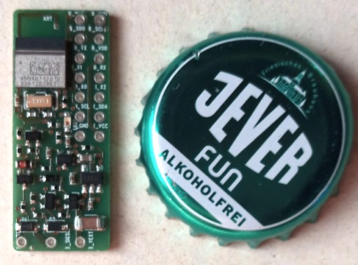
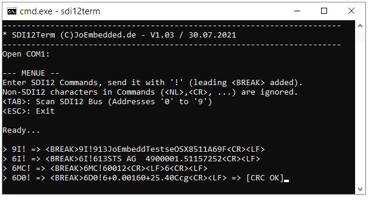

# Open SDI12-Blue
_An open implementation for a SDI12 Sensor node, based on Ultra-Low-Power Bluetooth CPU_

//======================================

//    --> Work In Pogress... <--

//======================================
 
## Hardware ##
Implementation with u-Blox ANNA-B112:



## Companion Project(s): ##
[SDI12Term - Simple Terminal for PC with simple RS232-Connector](https://github.com/joembedded/SDI12Term):



# Sponsors #
This project was sponsered and supported by:


Link: [TerraTransfer GmbH, Bochum, Germany](https://www.terratransfer.org)

# Installation
- Built with SES (V5.xx) and SDK 17.0.2
- Based on JesFs 

Use this Directory Structure:
```
C:\nordic\nRF5_SDK_17.0.2
+---components            // SDK
+---external              // SDK
+---integration           // SDK
+---open_projects
|   \---sdi_blue          // *HERE*
|       +---hardware
|       +---JesFs_Home
|       +---jw_libs
|       +---nordic_mods
|       +---sensor_libs
|       +---sensor_types
|       +---Tools
|       \---Uni_BLE        
```

---
