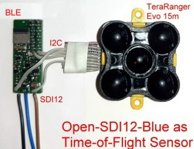
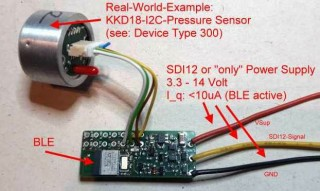
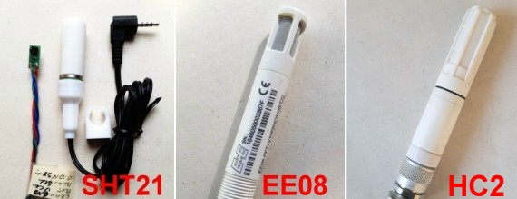
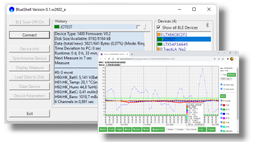

# Open SDI12-Blue #
_An open implementation for a SDI-12 Sensor node, based on Ultra-Low-Power Bluetooth CPU_

## Features ##
- Build your own SDI-12 V1.3 compatible Ultra-Low-Power Sensor with (often) less than 50 lines of Code
- Use traditional SDI-12 Bus or SDI12-Over-BLE to communicate with your Sensor
- No APP required, use Standard WEB-Blueooth-API (Live demo: [BLE API Live (in Repository LTX BLE Demo)](https://joembedded.github.io/ltx_ble_demo/ble_api/index.html)
- Optional: Secure Firmware-Updates-over-BLE (via BLE-API), Access Control via PIN, ...
- For humanitary, private or non-commercial use, this project is free!
- ...

*** This is Work In Pogress. If something fails (e.g. casued by changes
*** in the software), please read the comments in the sources.
*** All sensors have been (basically) tested and SDI-12 V1.3 communication verified

Current State:
- Testsensor (Device Type 200): stable and tested
- Ceramic Pressure Sensor KKD18 (Device Type 300): stable and tested
- Piezo Pressure Sensor KELLER LD (Device Type 310): stable and tested
- Barometric Pressure Sensor MS5607 (Device Type 320): stable and tested
- Frequency and Event Counter (up to 1kHz) (Device Type 330): stable and tested
- Temperature/Humidity Sensors SHT21 (Device Type 340): stable and tested
- High-Precision 24-Bit A/D ADS1220 (Device Type 350): stable and tested
- Precise rugged Temperature/Humidity Sensor EE08 (Device Type 360): stable and tested
- ToF Distance Sensor TeraRanger Evo (Device Type 370): stable and tested
- Precise Temperature/Humidity Sensor HC2 (Device Type 380): stable and tested
- MODBUS converter (here for E+H Radar Distance Sensor FMR20) (Device Type 390): stable and tested

todo: 
- Docu
- More Sensors (planed): 
  - other TOF/LIDAR Sensors for Distance Sensors
  - Simple Counter (eg. for Rain Counters)
  - Industrial Grade Particle Sensor (e.g SPS30)
  - ... *** Your contribution to this project is appreciated! ***
 
 
## Hardware ##
Implementation with u-Blox ANNA-B112:


Real World Project with Time-of-Flight Distance sensor:



Real World Project with KKD-18:



Real World Project with Barometric Pressure Sensor MS5607:


Different Temperature/Humidity Sensors: SHT21 (3D-printed) or Industrial EE08 or HC2:



## Companion Project(s): ##


Link: [SDI12Term - Simple Terminal for PC with simple RS232-Connector](https://github.com/joembedded/SDI12Term)



Link: [BlueShell - Shell for Windows 10 / 11 (free)](https://joembedded.de/x3/pcapp)


Link: [BLE API Live (in Repository LTX BLE Demo)](https://joembedded.github.io/ltx_ble_demo/ble_api/index.html)

## Read the full story... ##
PDF: [A real-world IoT project for rock monitoring in the Valais mountains (Switzerland)](./Img/Report_open_sdi12_en_rev2b.pdf)

## Links ###

Some Facts about SDI-12:
- SDI-12 is a very simple protocol, mainly designed for Ultra-Low-Power Meteorolocical and Hydrological Sensors
- It is a simple 3-wire Bus and allows up to 10 (optionally 64) sensor nodes with 500 mtr. total cable length
- Although SDI-12 is now available in V1.4, V1.3 is still sufficient for almost all needs (simply ignore Chapters 5 and 6 in the Specs)
- SDI-12 communicates in a human readable format, a CRC16 can be used optionally
- Own Commands can be added very easily (e.g. for Calibration Coeffients)
- The Open-SDI12-Blue Hardware works from 2.8V(!) to 14V Supply (originally SDI-12 requires 9.6V to 14V Supply)
- SDI-12 was first released in 1988 and is free to use

# Sponsors #
This project was sponsered and supported by:


Link: [TerraTransfer GmbH, Bochum, Germany](https://www.terratransfer.org)

# Installation
- Built with SES (V5.xx) and SDK 17.x.x
- Based on JesFs 

Use this Directory Structure:
```
C:\nordic\nRF5_SDK_17.1.0
+---components            // SDK
+---external              // SDK
+---integration           // SDK
+---open_projects
|   \---sdi_blue          // *HERE*
|       +---hardware
|       +---JesFs_Home
|       +---jw_libs
|       +---sensor_libs
|       +---sensor_types
|       +---Tools
|       \---Uni_BLE        
```

## Links ##
- The SDI-12 Support Group: https://www.sdi-12.org
- Wikipedia: https://en.wikipedia.org/wiki/SDI-12


---
