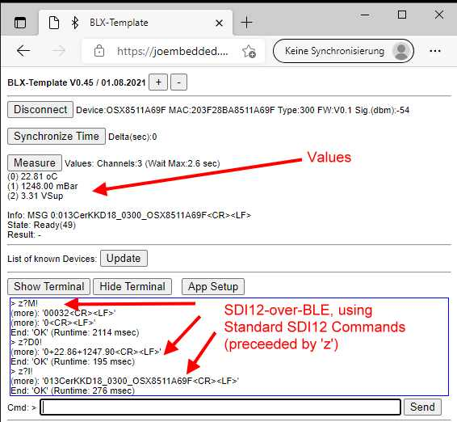

# Open SDI12-Blue
_An open implementation for a SDI12 Sensor node, based on Ultra-Low-Power Bluetooth CPU_

## Features ##
- Build your own SDI12 V1.3 compatible Ultra-Low-Power Sensor with (often) less than 50 lines of Code
- Use traditional SDII2 Bus or SDI12-Over-BLE to communicate with your Sensor
- No APP required, use Standard WEB-Blueooth-API (Live demo: [BLE API Live (in Repository LTX BLE Demo)](https://joembedded.github.io/ltx_ble_demo/ble_api/index.html)
- Optional: Secure Firmware-Updates-over-BLE (via BLE-API)
- ...

//======================================

*** This is Work In Pogress... ***

Current State:
- Testsensor (Device Type 200): stable and tested
- Real-World-Project KKD18 (Device Type 200): stable and tested

todo: 
- Docu
- More Sensors

//======================================
 
## Hardware ##
Implementation with u-Blox ANNA-B112:


Real World Project with KKD-18:

 "KKD18")

## Companion Project(s): ##


Link: [SDI12Term - Simple Terminal for PC with simple RS232-Connector](https://github.com/joembedded/SDI12Term)



Link: [BLE API Live (in Repository LTX BLE Demo)](https://joembedded.github.io/ltx_ble_demo/ble_api/index.html)


# Sponsors #
This project was sponsered and supported by:


Link: [TerraTransfer GmbH, Bochum, Germany](https://www.terratransfer.org)

# Installation
- Built with SES (V5.xx) and SDK 17.0.2
- Based on JesFs 

Use this Directory Structure:
```
C:\nordic\nRF5_SDK_17.0.2
+---components            // SDK
+---external              // SDK
+---integration           // SDK
+---open_projects
|   \---sdi_blue          // *HERE*
|       +---hardware
|       +---JesFs_Home
|       +---jw_libs
|       +---nordic_mods
|       +---sensor_libs
|       +---sensor_types
|       +---Tools
|       \---Uni_BLE        
```

---
